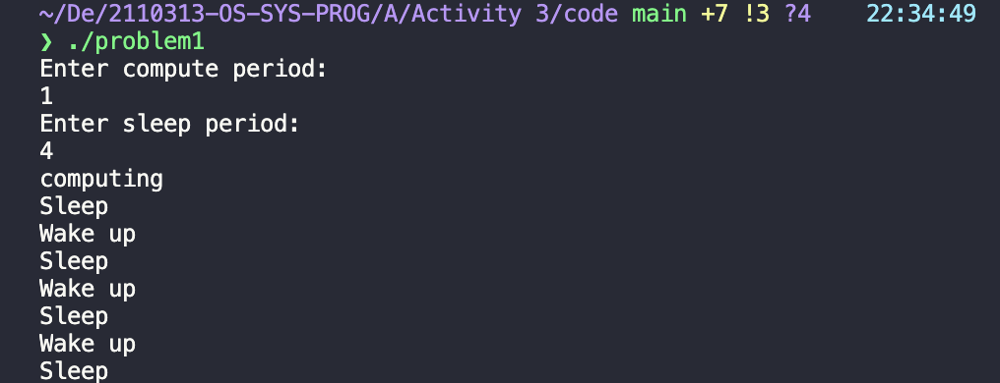
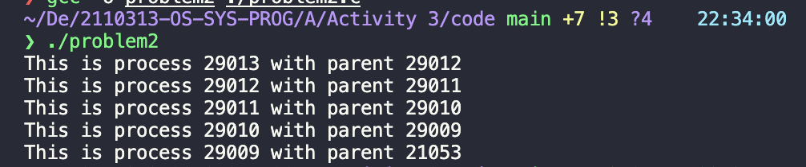
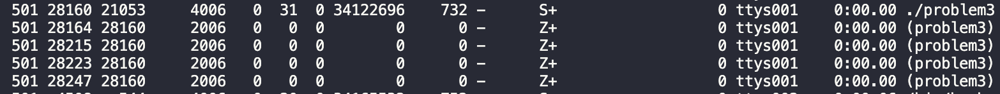

# Activity 3 Process concepts

## Group: กุ้ง

## Members

1. 6231316921 ณฐมน พลวิชัย
2. 6232035721 แสนยากร เสียงเสนาะ
3. 6232037021 อานนท์ จินดาวงค์

## Problem 1

```c
#include <stdio.h>
#include <stdlib.h>
#include <unistd.h>
#include <signal.h>

int compute_period = 5;
int sleep_period = 5;
int i;
/* what to do when alarm is on */
void on_alarm(int signal)
{
  printf("Sleep\n");
  sleep(sleep_period);
  printf("Wake up\n");
  /* activate alarm again */
  alarm(compute_period);
}

int main(int argc, char *argv[])
{
  printf("Enter compute period:\n");
  scanf("%d", &compute_period);
  printf("Enter sleep period:\n");
  scanf("%d", &sleep_period);

  /* on_alarm() is signal handler for SIGALARM */
  signal(SIGALRM, on_alarm);
  /* activate alarm */
  alarm(compute_period);
  /* compute infinitely but can be interrupted by alarm */
  for (i = 0;; i++)
  {
    if (i == 0)
      printf("computing\n");
  }
}
```
### อธิบาย

เดิมฟังก์ชันทำการรับค่าของตัวแปร `compute_period` และ `sleep_period` ผ่านทาง arguments `argv` 

### แก้ไข

แทนที่จะ assign ค่า `compute_period` และ `sleep_period` จาก `argv` ก็ทำการใช้ scanf รับค่าของตัวแปรผลลัพธ์ 

### ผลลัพธ์



## Problem 2

### แนวคิด

ทำให้ Parent Process รอ Child ทำงานเสร็จก่อน คล้ายรูปแบบของ Recursive

### แก้ไข

สลับบรรทัด wait กับ print โดยให้ wait ขึ้นก่อน print จะทำให้ Parent Process รอ Child Process ทำงานเสร็จก่อนจึงค่อย Print

### ผลลัพธ์



```c
#include <stdio.h>
#include <unistd.h>
#include <sys/types.h>
#include <sys/wait.h>

int main()
{
  int i;
  int n;
  pid_t childpid;

  n = 4;
  for (i = 0; i < n; ++i)
  {
    // clone
    childpid = fork();
    // id == 0 if it is a child
    if (childpid > 0)
    {
      break;
    }
  }
  wait(0); // waits for child to change state (in this case, terminate) before continuing
  printf("This is process %ld with parent %ld\n", (long)getpid(), (long)getppid());
  return 0;
}
```

## Problem 3

```c
#include <stdio.h>
#include <sys/types.h>
#include <unistd.h>
#include <sys/wait.h>
#include <stdlib.h>

int main()
{
  int i;
  int n;
  pid_t childpid;
  n = 4;
  for (i = 0; i < n; ++i)
  {
    childpid = fork();
    if (childpid == 0)
      break;
    else
      sleep(10);
  }
  printf("This is process %ld with parent %ld\n", (long)getpid(), (long)getppid());
  return 0;
}
```

### อธิบาย 

ภายใน for-loop, parent จะสร้าง child process ขึ้นมา 1 ตัว จากนั้นรอ 10 วินาที ในขณะที่ child process จะหลุดออกจาก loop แล้วไปทำงานจนเสร็จในทันที ทำให้ child เสร็จก่อน parent ดังนั้นจึงเกิด zombie process 4 ตัว

### แก้ไข

- ลบ `wait(0)`
- เพิ่ม คำสั่ง `sleep(10)` ให้กับ parent

### ผลลัพธ์


