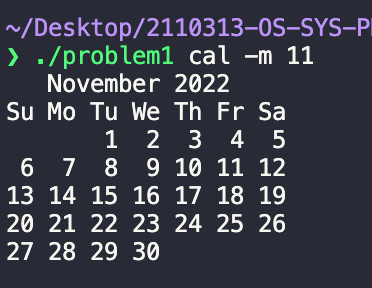
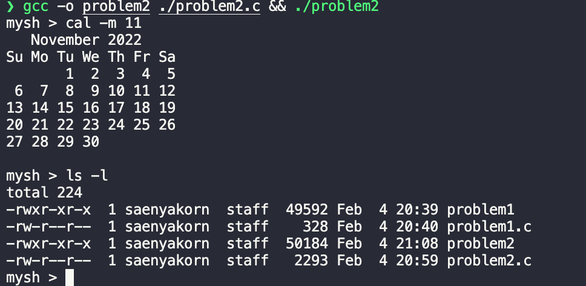

# Activity 4 Simple shell

## Group: กุ้ง

## Members

1. 6231316921 ณฐมน พลวิชัย
2. 6232035721 แสนยากร เสียงเสนาะ
3. 6232037021 อานนท์ จินดาวงค์

## Problem 1

```c
#include <stdio.h>
#include <stdlib.h>
#include <unistd.h>
#include <sys/wait.h>

int main(int argc, char *argv[])
{ 
  pid_t pid;

  pid = fork();
  if (pid < 0)
  {
    printf("Error : cannot fork\n");
    exit(1);
  }
  else if (pid == 0)
  {
    execvp(argv[1], argv + 1);
  }
  else
  {
    wait(NULL);
    return (0);
  }
}
```
### อธิบาย

เราสามารถรับ arguments ต่าง ๆ ของการเรียกโปรแกรมได้
จากนั้นเราก็จะใช้ arguments นี้ผ่านเข้าไปใน Process ลูก
หลังจากที่ execute เสร็จแล้วก็ให้ Process แม่ปิดโปรแกรมลง

### แก้ไข

`argc` คือจำนวน argument ที่ใส่เช้ามาและ `argv` คือ argument ที่ถูกตัดมาแล้วเช่น 

`./problem1 cal -m 11` 

จะได้ `argc` = 4 และ `argv` เป็น list ของ string `['./problem1', 'cal', '-m', '11']`

จากนั้นใช้คำสั่ง `execvp()` เพื่อรันคำสั่งใน argv ตั้งแต่ตัวที่ 1 เป็นต้นไป ในที่นี้คือ `['cal', '-m', '11']`

### ผลลัพธ์



## Problem 2

### แนวคิด

รับคำสั่งจาก terminal ด้วย `fgets()` จากนั้นเอาไป `tokenize()` แล้วใช้คำสั่ง `fork()` แล้วตามด้วย `execvp()`

### แก้ไข

รับสตริงเข้ามาด้วย `fgets()` แล้วแยกออกมาให้เป็น token จากนั้นทำการเช็คว่า token แรกเป็น `exit` หรือไม่ ถ้าใช่ก็หยุดการทำงาน แต่ถ้าไม่ใช่ ก็ fork child process ออกมา และทำการสั่ง `execvp(tokens[0], tokens)` เพิ่อรันคำสั่งใน child process

### ผลลัพธ์



```c
#include <stdio.h>
#include <stdlib.h>
#include <unistd.h>
#include <string.h>

int tokenize(char *string, char *delimiters, char ***arrayOfTokens);

int main()
{
  int run = 1;

  while (run)
  {
    printf("mysh > ");

    char delim[] = " \t\n";
    char **tokens;
    char string[256];
    int numtokens;
    int i;

    fgets(string, 256, stdin);
    numtokens = tokenize(string, delim, &tokens);

    if (strcmp(tokens[0], "exit") == 0)
    {
      printf("Bye Bye\n");
      return 0;
    }

    pid_t pid = fork();
    if (pid < 0)
    {
      printf("Error : cannot fork\n");
      exit(1);
    }
    // Child process
    else if (pid == 0)
    {
      execvp(tokens[0], tokens);
    }
    // Parent process
    else
    {
      wait(NULL);
    }
  }
  return 0;
}

...
```
