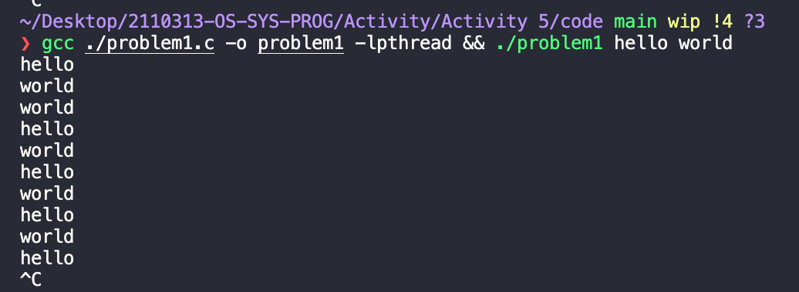
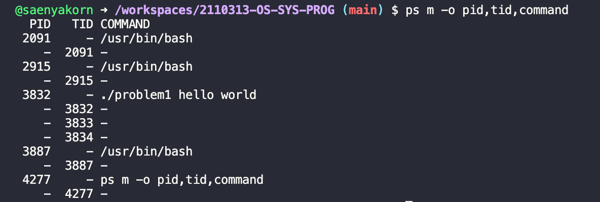
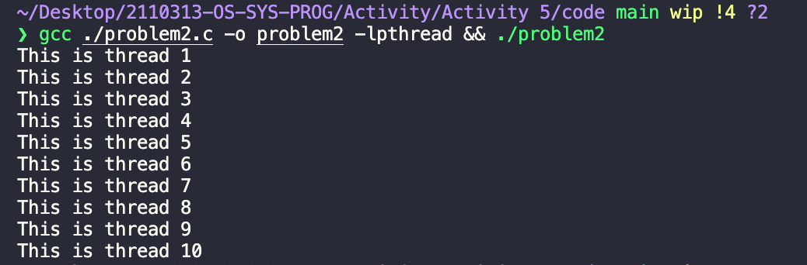
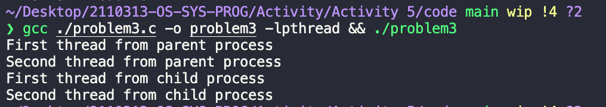

# Activity 5 Pthread Activity

## Group: กุ้ง

## Members

1. 6231316921 ณฐมน พลวิชัย
2. 6232035721 แสนยากร เสียงเสนาะ
3. 6232037021 อานนท์ จินดาวงค์

## Problem 1
ดัดแปลงโปรแกรมนี้ ให้สร้าง 2 thread ที่รับ argument 2 ตัว โดยที่ thread ตัวแรกแสดง argument แรก thread ตัวที่สองแสดง argument ตัวที่สอง

```c
#include <stdio.h>
#include <pthread.h>
#include <string.h>
#include <unistd.h>

void *say_hello(void *data)
{
  char *str;
  str = (char *)data;
  while (1)
  {
    printf("%s\n", str);
    sleep(1);
  }
  return (void *)0;
}

void main(int argc, char *argv[])
{
  pthread_t t1, t2;

  pthread_create(&t1, NULL, say_hello, argv[1]);
  pthread_create(&t2, NULL, say_hello, argv[2]);
  pthread_join(t1, NULL);
  pthread_join(t2, NULL);
}
```

เปิดอีกหน้าต่างแล้วป้อนคำสั่ง `ps  m -o pid,tid,command`
แสดงผลลัพธ์ใน Mycourseville ว่า โปรแกรมนี้ทำให้เกิด 2 thread

### ผลลัพธ์ 1



### ผลลัพธ์ 2



## Problem 2

เขียนโปรแกรมสร้างตัวแปรประเภท thread ที่เป็น array 10 ตัว  เมื่อเรียกโปรแกรม ทำงาน thread จะแสดงหมายเลขของตนเอง

```c
#include <stdio.h>
#include <pthread.h>
#include <string.h>
#include <unistd.h>

void *say_hello(void *data)
{
  int index = *(int *)data;
  printf("This is thread %d\n", index + 1);
  return (void *)0;
}

int main(int argc, char *argv[])
{
  int num_threads = 10;
  pthread_t t[num_threads];

  int i;
  for (i = 0; i < num_threads; i++)
  {
    pthread_create(&t[i], NULL, say_hello, &i);
    pthread_join(t[i], NULL);
  }

  return 0;
}
```

### ผลลัพธ์



## Problem 3
จงเขียนโปรแกรมที่โปรเซสแม่สร้างโปรเซสลูก โดยที่

- โปรเซสแม่สร้าง thread 2 ตัวโดยที่ thread ตัวแรกขึ้นข้อความ “First thread from parent process” และ thread ตัวที่สองขึ้นข้อความ “Second thread from parent process”

- โปรเซสลูกสร้าง thread 2 ตัวโดยที่ thread ตัวแรกขึ้นข้อความ “First thread from child process” และ thread ตัวที่สองขึ้นข้อความ “Second thread from child process”

```c
#include <stdio.h>
#include <pthread.h>
#include <string.h>
#include <unistd.h>

void *say_hello(void *data)
{
  int index = *(int *)data;
  switch (index)
  {
  case 0:
    printf("First thread from parent process\n");
    break;
  case 1:
    printf("Second thread from parent process\n");
    break;
  case 2:
    printf("First thread from child process\n");
    break;
  case 3:
    printf("Second thread from child process\n");
    break;
  }
  return (void *)0;
}

int main(int argc, char *argv[])
{

  pid_t pid;
  int id[] = {0, 1, 2, 3};
  pid = fork();

  pthread_t t1, t2;

  // if parent
  if (pid > 0)
  {
    pthread_create(&t1, NULL, say_hello, id);
    pthread_join(t1, NULL);
    pthread_create(&t2, NULL, say_hello, id + 1);
    pthread_join(t2, NULL);
  }
  // if child
  else if (pid == 0)
  {
    pthread_create(&t1, NULL, say_hello, id + 2);
    pthread_join(t1, NULL);
    pthread_create(&t2, NULL, say_hello, id + 3);
    pthread_join(t2, NULL);
  }

  return 0;
}
```

### ผลลัพธ์



